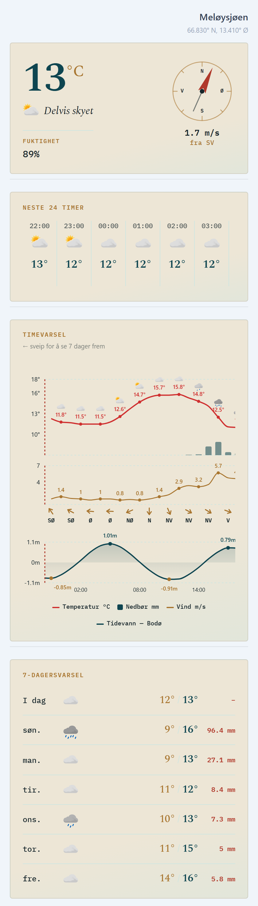
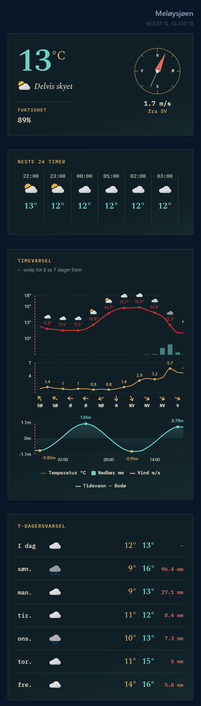

# Meløyvær

A weather and tide dashboard for Meløysjøen — a small fjord just inside the Arctic
Circle in Nordland, Norway. No accounts, no ads, no tracking — just the forecast.

**Website:** [meloyvar.vercel.app](https://meloyvar.vercel.app)

**Android app:** [Download the app](https://github.com/Scandiking/Mel-yv-r/releases/latest) — it's not on the Play Store (see [why](https://keepandroidopen.org)), so Android will show you a few scary "unknown sources" warnings on install. Don't worry about those popups... hehehehe...

**No iOS app** That needs a Mac, an iPhone, and a $99/year Apple Developer subscription, so it's Android/web only for now.

<table>
  <tr>
    <td></td>
    <td></td>
  </tr>
</table>

## What it shows

- **Current conditions** — temperature, sky, humidity, and a compass-rose dial for
  wind speed and direction, styled like a ship's instrument panel
- **Next 24 hours** — a scrollable hour-by-hour strip
- **7-day hourly chart** — temperature, precipitation, wind, and tide height in one
  connected, swipeable panel; hovering anywhere shows all four at once
- **7-day forecast** — daily highs/lows and precipitation totals
- **Tide times** — high and low water, when available for your location

Works with either your device's GPS or a manually entered position — the app asks
first and explains why, and remembers your choice.

Installable as a PWA (add to your phone's home screen) and caches the last forecast
so it still shows something useful with a spotty connection.

## Data sources

- Weather and tide forecasts: [MET Norway](https://api.met.no) (Meteorologisk institutt)
- Place names: [OpenStreetMap / Nominatim](https://nominatim.openstreetmap.org)

See [personvern.html](https://meloyvar.vercel.app/personvern.html) (Norwegian) for
the full rundown of what's shared with whom, and what's just cached on your own
device.

## Running it locally

```sh
npm install
npm run dev
```

Requires Node 20+. See [DEVLOG.md](DEVLOG.md) for the deeper implementation notes
and known rough edges.
