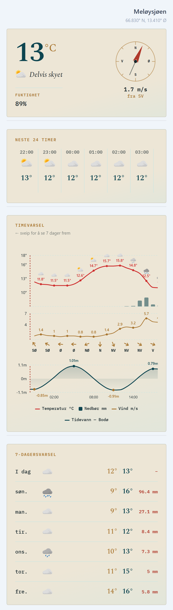
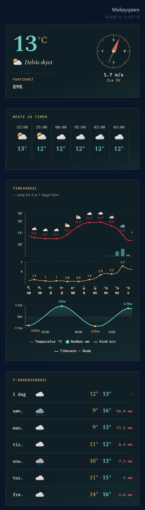

# Meløyvær

A stylized weather and tide dashboard for Meløy, a small place just inside the Arctic Circle in Nordland, Norway.

No accounts, no ads, no tracking. Just the forecast.

<table>
  <tr>
    <td></td>
    <td></td>
  </tr>
</table>


The repository is named `Mel-yv-r` on GitHub due to special-character limitations. The project itself is called Meløyvær.

**Website:** [meloyvar.vercel.app](https://meloyvar.vercel.app)

**Android:** [Download APK](https://github.com/Scandiking/Mel-yv-r/releases/latest). Not on the Play Store ([why](https://keepandroidopen.org)); Android will show a few "unknown sources" warnings on install.

**iOS:** Not available. Requires a Mac, an iPhone, and a $99/year Apple Developer subscription. I have none of that.

## Table of Contents

- [Install](#install)
- [Usage](#usage)
- [Data Sources](#data-sources)
- [Maintainer](#maintainer)
- [Contributing](#contributing)
- [License](#license)

## Install

**Web / PWA**  
Visit [meloyvar.vercel.app](https://meloyvar.vercel.app) in any modern browser. Use your browser's "Add to home screen" option to install it as a PWA.

**Android**  
Download the APK from [Releases](https://github.com/Scandiking/Mel-yv-r/releases/latest). Android will warn about installing from unknown sources — this is expected for apps distributed outside the Play Store.

**Local development**  
Requires Node 20+.

```sh
npm install
npm run dev
```

See [DEVLOG.md](DEVLOG.md) for implementation notes and known rough edges.

## Usage

Open the app and allow location access, or enter a position manually. The app explains what location is used for and remembers your choice.

The dashboard shows:

- **Current conditions**: temperature, sky, humidity, and a compass-rose dial for wind speed and direction
- **Next 24 hours**: a scrollable hour-by-hour strip
- **7-day hourly chart**: temperature, precipitation, wind, and tide height in one connected, swipeable panel; hovering or tapping shows all four values at once
- **7-day forecast**: daily highs/lows and precipitation totals
- **Tide times**: high and low water, when available for your location

The app caches the last forecast so it still shows something useful with a spotty connection. It is also installable as a PWA (add to your phone's home screen).

## Data Sources

- Weather and tide forecasts: [MET Norway](https://api.met.no) (Meteorologisk institutt)
- Place names: [OpenStreetMap / Nominatim](https://nominatim.openstreetmap.org)

See [personvern.html](https://meloyvar.vercel.app/personvern.html) (Norwegian) for what is shared with external services and what stays cached on your device.

## Maintainer

[@Scandiking](https://github.com/Scandiking)

## Contributing

PRs are welcome. Please open an [issue](https://github.com/Scandiking/Mel-yv-r/issues) first to discuss any significant changes.

## License

[GPL-3.0](LICENSE) © Scandiking
